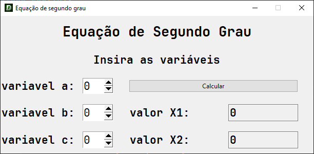
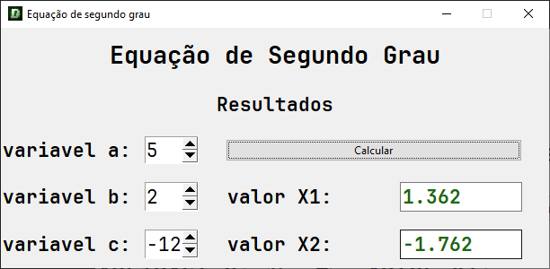
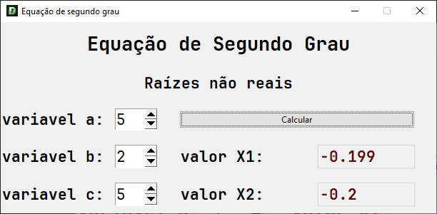

# Meus Estudos 📚
Esse repositório servirá como um armazenamento e demonstração dos conteúdos que vou aprendendo, tais como tkinter, pygame, etc...
Tenho como objetivo criar 12 projetos usando tkinter e depois partir para outra biblioteca, aprendendo cada vez mais.

## Projetos:
### 1. Tkinter: Calculadora de equações de segundo grau

Insira três valores, podendo receber entre 1 à 2 raízes e uma resposta falando se às raízes são reais ou não são reais.

- Raízes reais:

- Raízes não reais:

> [Código fonte ✨](tkinter/equacao-segundo-grau)