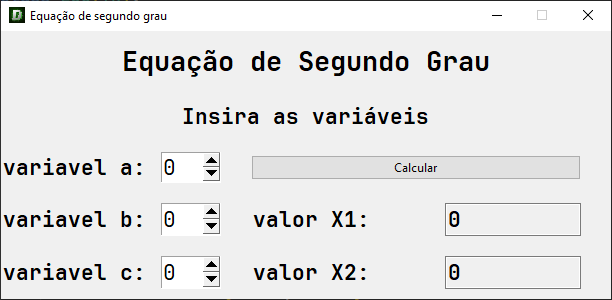

Meu primeiro projeto
uma calculadora de equações de segundo grau

recebendo 3 valores(A, B e C), retornando os 2 possíveis valores de X, e claro, retornando se as raízes são reais ou não

existem alguns easter eggs nesse aplicativo, você consegue encontrar?